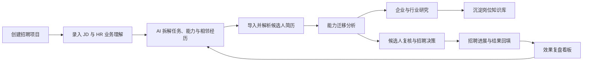
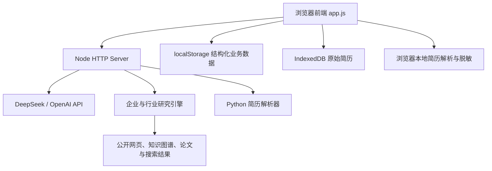
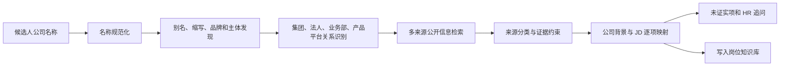

# TalentBridge 开发文档

## 1. 文档说明

TalentBridge 是一个面向中高端人才招聘的 AI 辅助决策产品。它不只匹配简历与 JD 中是否出现相同关键词，而是将岗位要求和候选人经历还原为底层任务、技术环境与能力证据，识别相邻经历之间的迁移关系，帮助 HR 找回传统 ATS 可能遗漏的高潜人才。

本文档基于当前可运行版本编写，供开发、部署、演示和后续交接使用。

- GitHub：<https://github.com/afterDDL/talentbridge>
- 线上 Demo：<https://talentbridge-production-1a40.up.railway.app>
- 开发者：[@afterDDL](https://github.com/afterDDL)

## 2. 产品业务闭环



主要用户是招聘 HR、猎头和业务招聘负责人。系统只提供分析依据、风险提示与追问建议，不替代 HR 作出最终招聘决定。

## 3. 技术架构

当前版本采用轻量、低依赖架构，适合快速演示和单实例部署。

| 层级 | 实现 |
| --- | --- |
| 前端 | 原生 HTML、CSS、JavaScript |
| 服务端 | Node.js 原生 `http` 模块 |
| 简历解析 | 浏览器端 pdf.js、Mammoth；服务端 Python |
| AI 模型 | DeepSeek 或 OpenAI，可通过环境变量切换 |
| 企业研究 | 多来源公开信息检索、实体关系识别与 AI 归纳 |
| 浏览器存储 | `localStorage`、IndexedDB |
| 服务端存储 | 无持久化数据库，仅使用内存缓存和临时文件 |
| 部署 | Docker、Railway；同时保留 Render 配置 |



## 4. 目录结构

```text
.
├── index.html                    # 页面结构、弹窗与导航
├── styles.css                   # 全局视觉样式和响应式布局
├── app.js                       # 前端状态、渲染、交互与业务闭环
├── server.js                    # 静态服务、API、模型调用与研究引擎
├── industry-research-skill.js   # 企业/行业研究方法与提示词
├── parse_resume.py              # 服务端 PDF、DOCX、文本解析
├── vendor/                      # 浏览器本地 PDF/DOCX 解析依赖
├── requirements.txt             # Python 依赖
├── package.json                 # Node 运行命令和版本约束
├── Dockerfile                   # 容器构建配置
├── railway.json                 # Railway 部署配置
├── render.yaml                  # Render 部署配置
└── TalentBridge-产品需求文档.md  # 产品需求与设计说明
```

前端目前采用单文件应用结构，所有页面由 `app.js` 根据 `state.view` 动态渲染。服务端同样集中在 `server.js`，适合 Demo，但继续扩展时建议按路由、AI 服务、研究服务和存储层拆分。

## 5. 本地开发

### 5.1 环境要求

- Node.js 20 或更高版本
- Python 3.10 或更高版本
- 可选：DeepSeek 或 OpenAI API Key

安装 Python 依赖：

```powershell
python -m pip install -r requirements.txt
```

项目没有第三方 Node 运行依赖，拉取代码后可直接启动：

```powershell
npm run check
npm start
```

默认地址为 <http://127.0.0.1:4174>。

### 5.2 AI 环境变量

使用 DeepSeek：

```powershell
$env:AI_PROVIDER="deepseek"
$env:DEEPSEEK_API_KEY="your-key"
$env:DEEPSEEK_MODEL="deepseek-chat"
npm start
```

使用 OpenAI：

```powershell
$env:AI_PROVIDER="openai"
$env:OPENAI_API_KEY="your-key"
$env:OPENAI_MODEL="gpt-5.4-mini"
npm start
```

未配置 Key 时，系统会进入 Demo 回退模式，返回内置演示数据，便于查看完整交互。

### 5.3 环境变量表

| 变量 | 默认值 | 用途 |
| --- | --- | --- |
| `HOST` | `0.0.0.0` | 服务监听地址 |
| `PORT` | `4174` | 服务端口 |
| `AI_PROVIDER` | `openai` | `openai` 或 `deepseek` |
| `OPENAI_API_KEY` | 空 | OpenAI API Key |
| `OPENAI_MODEL` | `gpt-5.4-mini` | OpenAI 模型 |
| `DEEPSEEK_API_KEY` | 空 | DeepSeek API Key |
| `DEEPSEEK_MODEL` | `deepseek-chat` | DeepSeek 模型 |
| `AI_MODEL` | 空 | 两类模型的通用覆盖值 |
| `PYTHON_BIN` | `python` | 服务端 Python 可执行文件 |

API Key 只配置在服务端环境变量中，不应写入前端代码或提交到 Git。

## 6. 前端设计

### 6.1 状态模型

核心状态集中在 `app.js` 的 `state` 对象，包括：

- 当前招聘项目、当前视图和项目步骤
- 候选人导入、筛选和当前选中候选人
- HR 复核决策、招聘阶段与结果评价
- 岗位知识包和企业研究结果
- 隐私模式、账户画像和已删除候选人

状态更新后通过统一渲染函数刷新主内容区域。交互主要使用事件委托，新增按钮或表单时，应同步检查其 `data-action`、渲染函数和事件处理分支。

### 6.2 浏览器存储

| 数据 | 存储位置 | 是否上传服务端 |
| --- | --- | --- |
| 招聘项目和岗位分析 | `localStorage` | 调用 AI 时上传必要字段 |
| 候选人结构化分析 | `localStorage` | 分析时上传脱敏文本或原文件 |
| 原始简历 | IndexedDB | 隐私模式下不上传 |
| 复核决策和招聘阶段 | `localStorage` | 否 |
| 招聘结果和效果评价 | `localStorage` | 否 |
| 岗位知识库 | `localStorage` | 企业研究时上传检索条件 |
| 用户画像 | `localStorage` | 作为分析上下文上传，不改变证据门槛 |

主状态键为 `talentbridge-demo-state-v1`，首次引导状态键为 `talentbridge-onboarding-seen`。IndexedDB 数据库为 `talentbridge-private-resumes`，原始简历存储在 `resumes` 对象仓库中。

`saveState()` 会主动排除 `rawResume`，避免原始简历正文进入 `localStorage`。

## 7. 简历导入与隐私模式

### 7.1 隐私模式开启

1. 浏览器使用 pdf.js、Mammoth 或 `FileReader` 本地提取文本。
2. 系统脱敏姓名、电话、邮箱、身份证、微信、QQ、地址、出生日期、年龄和性别。
3. 企业名称、岗位名称和技术背景保留，用于能力迁移分析。
4. 只将脱敏后的文本和岗位信息发送至 `/api/analyze-resume`。
5. 原始简历只写入当前浏览器的 IndexedDB。

### 7.2 隐私模式关闭

文件以 Base64 形式发送到 `/api/upload-resumes`。服务端将文件写入临时目录，调用 `parse_resume.py` 提取文本并完成分析，处理结束后删除临时目录。

支持 PDF、DOCX、TXT 和 Markdown。当前不包含 OCR，扫描版 PDF 可能因无法提取足够文本而失败。

### 7.3 数据限制

- 单个请求 JSON 最大约 1 MB
- 上传请求体最大约 30 MB
- 单文件最大 8 MB
- 单次文件总量最大 20 MB
- 单次最多 10 份简历

删除候选人时，系统会同步删除其 IndexedDB 原始简历、复核决策和结果评价。

## 8. 服务端 API

所有业务 API 均返回 JSON。API 响应使用 `Cache-Control: no-store`。

### 8.1 健康检查

```http
GET /api/health
```

返回当前运行模式、AI 提供商和模型：

```json
{
  "ok": true,
  "mode": "live",
  "provider": "deepseek",
  "model": "deepseek-chat"
}
```

### 8.2 岗位理解

```http
POST /api/analyze-job
Content-Type: application/json
```

```json
{
  "title": "3D 先进封装工艺工程师",
  "jd": "岗位职责与任职要求",
  "recruiterContext": "HR 对业务的碎片化理解"
}
```

返回岗位真正要解决的问题、5 至 8 项关键能力，以及 3 至 6 类可能具备迁移价值的相邻经历。HR 可以在界面中展开和修改这些结果。

### 8.3 候选人分析

```http
POST /api/analyze-resume
Content-Type: application/json
```

```json
{
  "resume": "脱敏后的简历文本",
  "job": {
    "title": "岗位名称",
    "jd": "岗位要求",
    "recruiterContext": "HR 业务理解",
    "capabilities": [],
    "adjacent": []
  },
  "profile": {}
}
```

返回候选人事实、五维可比性、迁移边界、证据覆盖度、置信度、风险点、建议追问和推荐结论。

### 8.4 企业研究

```http
POST /api/research-company
Content-Type: application/json
```

```json
{
  "company": "候选人原公司",
  "job": {
    "title": "目标岗位",
    "jd": "岗位要求",
    "recruiterContext": "HR 业务理解"
  }
}
```

返回研究主体关系、产业定位、产品技术方向、与 JD 的逐项映射、证据来源和未证实事项。

### 8.5 服务端批量导入

```http
POST /api/upload-resumes
Content-Type: application/json
```

请求包含 `files` 数组和 `job` 对象。每个文件包含名称、MIME 类型和 Base64 数据。该接口只用于关闭隐私模式后的服务端解析。

## 9. AI 分析机制

### 9.1 岗位能力拆解

岗位理解不只依赖 JD，还会结合 HR 输入的业务理解。系统将岗位拆分为：

- 真正需要解决的业务或技术任务
- 必须、重要和加分能力
- 可迁移的相邻岗位、技术路线或行业经历
- HR 需要进一步确认的模糊边界

HR 修改后的能力口径会成为后续候选人分析的正式输入。

### 9.2 候选人五维比较

能力迁移判断主要比较：

1. 业务目标是否相近
2. 工作对象或技术对象是否可比
3. 方法、流程和工具是否相通
4. 约束条件和复杂度是否相近
5. 候选人的个人责任及结果是否有证据

当候选人没有被关键词 ATS 命中时，系统不会仅凭宽泛行业相关性给出高匹配。进入“找回”或“建议复核”通常至少需要：

- 三个维度存在有效证据
- 两个维度达到充分可比
- 存在明确的任务或技术锚点
- 能识别候选人本人承担的责任

证据不足时，结果应保持“信息不足”或“待确认”，而不是由模型补全事实。

### 9.3 模型适配

OpenAI 使用 Responses API 和严格 JSON Schema。DeepSeek 使用 Chat Completions JSON 输出，并在服务端执行字段校验和结果归一化。

新增模型提供商时，建议：

1. 实现独立的请求函数和超时控制。
2. 将结果统一转换为当前岗位或候选人数据结构。
3. 复用服务端的证据门槛与结果校验，不把安全边界仅写在提示词中。
4. 在 `/api/health` 暴露当前模型，便于排查环境问题。

## 10. 企业与行业研究

研究逻辑定义在 `industry-research-skill.js`，当前版本标识为 `industry-research-v6`。

### 10.1 研究流程



检索来源包括：

- 公司官网、公告和一手资料
- Wikidata、Wikipedia 等实体识别来源
- 独立新闻、专业媒体和行业资料
- DuckDuckGo、Bing RSS 等搜索结果
- OpenAlex 等公开研究资料

系统会区分集团、法律实体、业务部门、产品线和品牌。例如简历写“华为半导体”时，研究流程应继续识别华为内部半导体体系与海思等核心业务主体的关系，而不是只检索字面上完全一致的公司名称。

### 10.2 证据边界

- 集团事实不能直接当作候选人所在实体的事实。
- 企业技术背景不能直接当作候选人的个人能力。
- 行业通用路线不能反推某家公司一定采用该路线。
- 只有行业资料、没有公司证据时，不生成公司确定性结论。
- 每个关键判断需要保留来源，无法证明的内容明确标为未证实。

服务端对研究网页实施协议、DNS、私网地址和跳转检查，以降低 SSRF 风险。单页面抓取上限约 600 KB，超时约 9 秒，最多跟随 4 次跳转。

研究结果使用内存缓存，默认有效期 24 小时；服务重启后缓存会清空。

## 11. 复核、结果回填与效果看板

HR 可对候选人选择：

- 推荐联系
- 暂缓
- 不合适
- 信息不足

同时可记录判断理由、备注和招聘阶段。阶段包括待联系、已联系、愿意沟通、进入面试、面试通过、Offer、已入职、淘汰和候选人拒绝等。

效果看板按实际回填数据计算：

- 复核率 = 已作人工判断人数 / 候选人总数
- 联系转化率 = 已联系人数 / 推荐联系人数
- 面试转化率 = 进入面试人数 / 已联系人数
- Offer 转化率 = Offer 人数 / 进入面试人数
- 找回有效性 = 被 AI 找回且获得正向人工或流程结果的候选人数

召回率和精确率只有在候选人拥有明确人工标签或后续招聘结果时才有意义。不能用 AI 自己的判断同时作为预测值和真实标签。

## 12. 部署

### 12.1 Railway

当前生产环境使用 Railway，并连接 GitHub `main` 分支。Railway 按 `railway.json` 使用 Dockerfile 构建：

1. Node 22 Debian 镜像
2. 安装 Python 3 和虚拟环境
3. 安装 `requirements.txt`
4. 复制前后端代码与浏览器解析依赖
5. 执行 `node server.js`
6. 使用 `/api/health` 进行健康检查

在 Railway Variables 中配置 AI 环境变量后，推送到 `main` 会自动触发部署。

### 12.2 本地容器验证

```powershell
docker build -t talentbridge .
docker run --rm -p 4174:4174 `
  -e AI_PROVIDER=deepseek `
  -e DEEPSEEK_API_KEY=your-key `
  talentbridge
```

### 12.3 部署后检查

```powershell
Invoke-RestMethod `
  -Uri "https://talentbridge-production-1a40.up.railway.app/api/health" `
  -Method Get
```

随后至少人工验证一次岗位分析、隐私模式简历导入、企业研究、候选人复核和结果回填。

## 13. 测试与验收

当前仓库未引入自动化测试框架。提交前至少执行：

```powershell
npm run check
```

建议使用以下核心回归清单：

1. 新建项目后，JD 和 HR 业务理解可保存并重新编辑。
2. 岗位能力、必须项和相邻经历可展开查看和修改。
3. 隐私模式导入 PDF、DOCX、TXT 时，原始简历可查看且不会进入 `localStorage`。
4. 关闭隐私模式后，服务端能解析文件并清理临时目录。
5. 候选人可以删除，关联简历、复核与结果记录同步清除。
6. AI 分析页优先展示关键能力点、迁移证据、风险和追问，不被长文本淹没。
7. 企业研究能识别别名、集团、子公司、业务部和品牌关系，并展示来源。
8. 公开信息不足时不编造公司技术结论。
9. 复核决定、招聘阶段和评价在刷新页面后仍然存在。
10. 看板指标只使用真实回填数据计算。

## 14. 已知限制

当前版本定位为作品 Demo，而非可直接处理企业真实招聘数据的生产系统，主要限制包括：

- 无登录、角色权限和租户隔离
- 无服务端数据库，业务数据只保存在当前浏览器
- 无跨设备同步、备份和恢复
- 无 API 限流、配额、审计日志和运营后台
- 企业研究受公开网页可访问性和搜索来源稳定性影响
- 内存缓存不适用于多实例部署
- 简历解析不支持 OCR 和复杂表格版式
- 缺少自动化单元测试、接口测试和端到端测试
- 尚未建立正式的数据保留、删除和用户授权机制

## 15. 生产化建议

若进入真实企业试点，建议按以下顺序演进：

1. 增加身份认证、企业租户、岗位级权限和操作审计。
2. 引入 PostgreSQL 等数据库，将项目、候选人、决策、结果和知识库服务端持久化。
3. 原始简历进入加密对象存储，提供明确的保留期限和彻底删除机制。
4. 将简历解析、AI 分析和企业研究改为异步任务，增加重试、进度和失败恢复。
5. 将 `server.js` 拆分为路由、业务服务、模型适配器、研究引擎和数据访问层。
6. 为企业实体关系建立可维护的别名表和证据图谱，而非完全依赖实时搜索。
7. 建立经 HR 标注的离线评测集，分别评估召回、精确、证据一致性和推荐校准度。
8. 增加模型输出监控、成本统计、提示词版本管理和灰度发布。

## 16. 二次开发入口

- 修改页面和交互：`index.html`、`styles.css`、`app.js`
- 修改岗位或候选人分析口径：`server.js` 中的提示词、Schema 和结果校验
- 修改企业研究方法：`industry-research-skill.js`
- 增加简历格式或 OCR：`parse_resume.py` 及浏览器本地解析函数
- 新增 AI 提供商：在 `server.js` 增加适配函数，并接入统一 `callAI`
- 增加数据库：优先抽离 `state` 对应的数据模型和服务端存储接口
- 增加新业务指标：先定义真实标签来源，再修改回填模型和看板计算

任何涉及“匹配结论”的改动，都应同时检查证据来源、信息不足状态和人工复核入口，避免把模型推断包装成确定事实。
